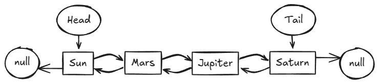

23 (WSL) Oracle OpenJDK 23.0.1\
###_____ Java: Классы ____###\
Курсс_№_2\
###_____ Задания ____###

№_1\
App.java\
TextUtils.java

Предположим, мы разрабатываем приложение, в котором пользователи могут 
публиковать собственные статьи. Для публикации у нас есть одно 
условие — статья должна содержать не менее 10 слов. Для проверки выполнения 
этого условия нам понадобится посчитать количество слов в статье. 
Вам предстоит разработать утилиту, которая будет делать это

src/main/java/io/hexlet/util/TextUtils.java
В файле создайте публичный класс TextUtils, который будет содержать утилиты 
для работы с текстом. В классе реализуйте публичный статический 
метод getWordsCount(), который принимает в качестве параметра 
текст — значение типа String. Метод должен вернуть целое 
число — количество слов в тексте. Слова в тексте разделены одним пробелом, 
а значит словом считается любая последовательность, не содержащая пробелов.

```import io.hexlet.util.TextUtils;

TextUtils.getWordsCount(""); // 0
TextUtils.getWordsCount("man in BlacK"); // 3
TextUtils.getWordsCount("  hello, world!  "); // 2
```
№_2\
Book.java\
App.java

src/main/java/io/hexlet/model/Book.java

В файле создайте класс Book, который будет представлять собой книгу в нашем 
приложении. Класс содержит следующие поля:

title — название книги, строка
author — имя автора книги, строка
published — год публикации, целое число
Реализуйте в классе конструктор

Так как наш класс неявно наследуется от класса Object, ему уже доступен 
метод toString() со стандартным поведением. Переопределите метод toString() 
так, чтобы сделать собственное текстовое представление книги:
```
var book = new Book("First Folio", "William Shakespeare", 1623);
System.out.println(book); //=> Book "First Folio" written by William Shakespeare published in 1623
```
№_3\
Предположим, мы разрабатываем каталог автомобилей. Вам предстоит реализовать метод,
который будет производить поиск автомобиля в этом каталоге

src/main/java/io/hexlet/App.java
В классе App создайте публичный статический метод contains(), который принимает два параметра:

Каталог автомобилей — массив Car[]
Автомобиль Car, который мы ищем.
Метод должен вернуть true, если такой же автомобиль есть в каталоге и false в ином случае
```
Car[] cars = {
new Car("Aston Martin", "V8 Vantage", 2011),
new Car("Ford", "VWindstar", 1998),
new Car("Lotus", "Exige", 2006)
};

var car1 = new Car("Lotus", "Exige", 2006);
App.contains(cars, car1); // true

var car2 = new Car("Lotus", "Exige", 2009);
App.contains(cars, car2); // false
```
src/main/java/io/hexlet/model/Car.java
В классе Car переопределите методы equals() и hashCode() так, 
чтобы сравнение двух объектов класса Car происходило по содержимому. 
Считаем, что автомобили идентичны, если у них совпадают марка, модель и год выпуска.
```
var car1 = new Car("bmv", "x5", 1998);
var car2 = new Car("bmv", "x5", 1998);
car1.equals(car2); // true

var car3 = new Car("bmv", "x5", 2000);
car1.equals(car3); // false
```
Методы equals() и hashCode() работают в связке, так что эти методы нужно переопределять парно

###_____ Решение Учителя ____###

package io.hexlet;
```
import io.hexlet.model.Car;

class App {
    public static boolean contains(Car[] cars, Car car) {
        for (var currentCar : cars) {
            if (currentCar.equals(car)) {
            return true;
            }
        }
        return false;
    }
}
```
###_____ Lombok ____###\
[Project Lombok](https://projectlombok.org/#) \
Project Lombok - это библиотека java, которая автоматически подключается 
к вашему редактору и инструментам сборки, придавая пикантность вашей java.
Никогда больше не пишите другой метод getter или equals, с одной аннотацией 
ваш класс имеет полнофункциональный конструктор, автоматизирующий ведение 
журнала переменных и многое другое.

№_4\
src/main/java/io/hexlet/model/Film.java \
В файле создайте класс Film, который будет представлять собой фильм. 
Класс содержит следующие поля:

title — название фильма, строка
director — имя режиссера, строка
produced — год выпуска, целое число
genre — жанр фильма, строка
actors — имена актеров, массив строк
duration — длительность фильма в минутах, целое число
Реализуйте в классе пустой конструктор и конструктор со всеми полями. 
Добавьте в класс геттеры и сеттеры для всех полей. 
Переопределите методы equals() и hashCode() так, 
чтобы сравнение фильмов происходило по содержимому всех полей объекта, кроме поля duration
```
var film1 = new Film(
"Man Who Sleeps",
"John Doe",
1998,
"action",
new String[] {"Jack Jones", "Anna S"},
123
);

film.getDirector(); // John Doe 
film.setDuration(250);
film.getDuration(); // 250
```
Подсказки \
Параметры аннотации [EqualsAndHashCode](https://javadoc.io/doc/org.projectlombok/lombok/1.16.18/lombok/EqualsAndHashCode.html#exclude--) \
Статья про [EqualsAndHashCode](https://www.baeldung.com/java-lombok-equalsandhashcode)

№_5 \
###_____ Data-классы ____###

src/main/java/io/hexlet/dto/CustomerDTO.java
В файле создайте класс CustomerDTO, который будет служить в нашем приложении для получения извне данных о покупателе. 
Класс содержит следующие поля:

firstName — имя покупателя, строка
lastName — фамилия покупателя, строка
email — адрес электронной почты, строка
Сделайте поля класса неизменяемыми и реализуйте в классе конструктор и геттеры
```
var customerDTO = new CustomerDTO("Anna", "Smith", "anna@gmail.com");
```
###_____ Решение ____###
```
CustomerDTO.java
import lombok.AllArgsConstructor;
import lombok.Getter;

@AllArgsConstructor
@Getter
public class CustomerDTO {
private final String firstName;
private final String lastName;
private final String email;
}
```
№_6\
###_____ Задание ____###\
Представьте, что мы разрабатываем логистическое приложение, 
которое следит за транспортировкой и хранением грузов. 
Одно из сущностей нашего приложения — это склад товаров. 
У нашего склада есть максимальная вместимость. 
Мы не можем разместить на складе товаров больше, чем там поместится. 
И не можем забрать со склада товаров больше, чем там сейчас есть

src/main/java/io/hexlet/ProductsStorage.java\
В файле создайте класс ProductsStorage, который представляет собой склад 
товаров

Класс содержит следующие поля:

goodsQuantity — количество товара на складе\
maxCapacity — максимальная вместимость склада\
Реализуйте в классе конструктор со всеми полями и геттеры\

Реализуйте в классе следующие методы, которые меняют состояние объекта 
склада:

placeProducts() — добавляет новые товары на склад. Метод принимает в качестве параметра целое число — количество товара, 
которое нужно разместить на складе

takeProducts() — забирает товары со склада. Метод принимает в качестве параметра целое число — количество товара, 
которое мы изымаем со склада

Ваша задача — проследить за целостностью состояния объекта, чтобы оно не нарушалась. 
Правила такие: мы не можем загрузить на склад товаров больше, чем он может вместить. 
И не можем забрать больше, чем есть сейчас. При попытке сделать это методы должны вывести на экран сообщение о том, 
что действие не возможно выполнить, а состояние объекта не должно измениться. 
Содержание сообщения остается на ваше усмотрение
```
// Создаем новый объект склада с начальным количеством товара и максимальной вместимостью
var storage = new ProductsStorage(20, 50);

// Размещаем там товар
storage.placeProducts(20);
storage.getGoodsQuantity(); // 40

// Будет превышена максимальная вместимость
storage.placeProducts(60); // => Общее количество товара превысит максимальную вместимость
// Состояние склада не изменилось
storage.getGoodsQuantity(); // 40

// Забираем товары со склада
storage.takeProducts(30);
storage.getGoodsQuantity(); // 10

// Это больше, чем есть сейчас
storage.takeProducts(60); // => Такого количество товара нет на складе
storage.getGoodsQuantity(); // 10
```
###_____ Решение ____###
```
package io.hexlet.model;
import lombok.AllArgsConstructor;
import lombok.Getter;
import lombok.NoArgsConstructor;

@NoArgsConstructor
@AllArgsConstructor
@Getter
public class ProductsStorage {
private int goodsQuantity;
private int maxCapacity;

public void placeProducts(int quantityProducts) {
int balance = goodsQuantity + quantityProducts;

        if (balance <= maxCapacity) {
            goodsQuantity = balance;
        } else {
            System.out.println("Операция не выполнена!\n" +
                    "Количество товара превышает допустимое значение");
        }
    }

    public void takeProducts(int quantityProducts) {
        if (goodsQuantity >= quantityProducts) {
            goodsQuantity -= quantityProducts;
        } else {
            System.out.println("Операция не выполнена!\n" +
                    "Такого количества товара на складе нет.");
        }
    }
}
```
###_____ Решение Учителя ____###
```
import lombok.AllArgsConstructor;
import lombok.Getter;

@AllArgsConstructor
@Getter
class ProductsStorage {
private int goodsQuantity;
private int maxCapacity;

    public void placeProducts(int quantity) {

        if ((goodsQuantity + quantity) > maxCapacity) {
            System.out.println("Общее количество товара превысит максимальную вместимость");
            return;
        }

        goodsQuantity += quantity;
    }

    public void takeProducts(int quantity) {

        if ((goodsQuantity - quantity) < 0) {
            System.out.println("Такого количество товара нет на складе");
            return;
        }

        goodsQuantity -= quantity;
    }
}
```
###_____ Задание ____###\
// №_7\
В этом упражнении мы создадим собственный класс для генерации случайных чисел

src/main/java/io/hexlet/MyRandom.java
В файле создайте класс MyRandom, который будет представлять собой наш 
собственный генератор чисел. Генератор предназначен для получения 
случайных чисел в диапазоне от 1 до 100 включительно. 
Конфигурацию нашего генератора — верхнюю и нижнюю границы диапазона будем хранить в статических свойствах. 
Создайте в классе соответствующие статические свойства.

Реализуйте в классе публичный статический метод generate(), который будет 
возвращать случайное число типа int в диапазоне, указанном в конфиге класса

MyRandom.generate(); \
// Целое число в диапазоне от 1 до 100
Подсказки
Случайное число можете получить любым удобным вам способом. 
Возможно, вам пригодится метод [Math.random()](https://docs.oracle.com/javase/8/docs/api/java/lang/Math.html#random--)

###_____ Решение ____###
```
public class MyRandom {
public static int minValue = 1;
public static int maxValue = 100;

    public static int generate() {
        return minValue + (int)(Math.random() * (maxValue - minValue) + 1);
    }
}
```
###_____ Решение Учителя ____###
```
class MyRandom {
public static final int MIN = 1;
public static final int MAX = 100;

    public static int generate() {
        return (int) Math.floor(Math.random() * (MAX - MIN + 1)) + MIN;
    }
}
```
//===========================================================================\
###_____ Java: Списки ____###\
// №_8\
###_____ Задание ____###\
У списков в Java есть метод get(), который возвращает элемент списка по 
указанному индексу. А в случае, если такого индекса нет, выбрасывает исключение. 
Вам предстоит создать свой собственный вариант такого метода, но с небольшим 
отличием в поведении

src/main/java/io/hexlet/App.java
В классе App реализуйте публичный статический метод getOrDefault(), 
который принимает на вход три параметра:

Исходная коллекция элементов, список строк List<String>
индекс элемента, который мы хотим получить, целое число
дефолтное значение, строка
Метод должен вернуть элемент списка по указанному индексу. 
Но, в отличие от стандартного метода списков, в случае, если такого индекса 
нет, наш метод должен вернуть дефолтное значение, а не выбрасывать исключение

var capitals = List.of("london", "berlin", "tokio");

App.getOrDefault(capitals, 1, ""); // "berlin"
App.getOrDefault(capitals, 2, ""); // "tokio"
App.getOrDefault(capitals, 5, ""); // ""
App.getOrDefault(capitals, -2, ""); // ""
Подсказки\
Изучите [документацию](https://docs.oracle.com/en/java/javase/21/docs/api/java.base/java/util/List.html#get(int))
на метод get(). Посмотрите, в каком случае он 
считает, 
что индекс не существует. Используйте это в собственном методе для 
проверки существования индекса

###_____ Решение ____###
```
public static String getOrDefault(List<String> listStr, int index, String def) {

try {
return listStr.get(index);
} catch (IndexOutOfBoundsException e) {
return def;
}
}
```
###_____ Решение Учителя ____###
```
import java.util.List;

class App {

public static String getOrDefault(List<String> items, int index, String defaultValue) {
if (index >= items.size() || index < 0) {
return defaultValue;
}
        return items.get(index);
    }    
}
```
№_9 \
###_____ Задание ____###\

src/main/java/io/hexlet/App.java\
В классе App реализуйте публичный статический метод replaceByZero(), 
который принимает в качестве парамера список List целых чисел. 
Метод должен вернуть новый список, в котором все отрицательные числа заменены на нули. 
Метод не должен менять исходный список
```
var items = List.of(1, -2, 3, -5);

var result = App.replaceByZero(items);
System.out.println(result); // => [1, 0, 3, 0]

// Исходный список не изменился
System.out.println(items); // => [1, -2, 3, -5]
```
###_____ Решение ____###
```
public static List<Integer> replaceByZero(List<Integer> numbers) {
var newNumbers = new ArrayList<Integer>();
for (var number : numbers) {
number = (number > 0) ? number : 0;
newNumbers.add(number);
}
return newNumbers;
}
```
###_____ Решение Учителя ____###
```
import java.util.List;
import java.util.ArrayList;

class App {
// BEGIN
public static List<Integer> replaceByZero(List<Integer> items) {
var result = new ArrayList<Integer>();

        for (var item : items) {
            var processedItem = item > 0 ? item : 0;
            result.add(processedItem);
        }

        return result;
    }
    // END
}
```
№_10\
src/main/java/io/hexlet/App.java\
В классе App реализуйте публичный статический метод getProductsByPrice(),
который фильтрует список товаров по цене. Метод принимает три параметра:

Список List<Product> товаров\
Минимальная цена товара, целое число\
Максимальная цена товара, целое число
Метод должен вернуть список названий тех товаров, цена которых 
укладывается в переданный диапазон, включая границы диапазона
```
var products = List.of(
new Product("bread", 5),
new Product("milk", 10),
new Product("fish", 30)
);

var result = App.getProductsByPrice(products, 10, 30);
System.out.println(result); // => ["milk", "fish"]
```
###_____ Решение ____###
```
class App {
// BEGIN (write your solution here)
public static List<String> getProductsByPrice(List<Product> products,
int minPrice, int maxPrice) {
var newProducts = new ArrayList<String>();
for (var product : products) {
if (product.getPrice() >= minPrice && product.getPrice() <= maxPrice) {
newProducts.add(product.getTitle());
}
}
return newProducts;
}
// END
}
```
###_____ Решение Учителя ____###
```
import java.util.List;
import java.util.ArrayList;
import io.hexlet.model.Product;

class App {
// BEGIN
public static List<String> getProductsByPrice(List<Product> products, int min, int max) {
var productTitles = new ArrayList<String>();

        for (var product : products) {
            var price = product.getPrice();

            if (price >= min && price <= max) {
                var title = product.getTitle();
                productTitles.add(title);
            }
        }

        return productTitles;
    }
    // END
}
```
###_____ Страница модуля ____###\
Списки в определении типов
[Интерфейс List](https://docs.oracle.com/en/java/javase/21/docs/api/java.base/java/util/List.html)

###_____ Задание ____###\
№_11\
В этом упражнении мы лишний раз потренируемся обрабатывать списки, а заодно применим подход, рассмотренный в уроке.

src/main/java/io/hexlet/App.java\
В классе App реализуйте публичный статический метод countBooks(), который посчитает общее количество книг автора. Метод принимает три параметра

Список книг\
Имя автора, строка\
Жанр, строка\
Метод должен вернуть общее количество книг в библиотеке, написанных нашим автором в определенном жанре
```
var books = List.of(
new Book("Death on the Nile", "Agatha Christie", "Detective"),
new Book("Murder on the Orient Express", "Agatha Christie", "Detective"),
new Book("The Raven", "Edgar Allan Poe", "Poem")
);

App.countBooks(books, "Agatha Christie", "Detective"); // 2
```
Реализуйте метод так, чтобы он мог принимать в качестве списка книг любую реализацию интерфейса List

###_____ Решение ____###
```
public static int countBooks(List<BookS> books,
String nameAuthor, String genre) {
int quantityBooks = 0;
for (BookS book : books) {
if (nameAuthor.equals(book.getAuthorName()) && genre.equals(book.getGenre())) {
quantityBooks++;
}
}
return quantityBooks;
}
```
###_____ Решение Учителя ____###
```
import java.util.List;
import io.hexlet.model.Book;

class App {
// BEGIN
public static int countBooks(List<Book> books, String authorName, String genre) {

        var booksCont = 0;

        for (var book : books) {
            var bookAuthor = book.getAuthorName();
            var bookGenre = book.getGenre();

            if (bookAuthor.equals(authorName) && bookGenre.equals(genre)) {
                booksCont++;
            }
        }

        return booksCont;
    }
    // END
}
```
###_____ Задание ____###\
//№_12

Одно из типичных действий в социальных сетях - поиск общих друзей. В этом упражнении вам предстоит реализовать аналогичный функционал

src/main/java/io/hexlet/App.java
В классе App реализуйте публичный статический метод getCommonFriends(), который находит общих друзей у двух пользователей. Метод принимает два параметра - пользователей, у которых мы ищем общих друзей

Метод должен вернуть список List<User> друзей, которые являются общими для двух переданных пользователей
```
var user1 = new User("John");
user1.addFriend(new User("Ellery"));

var user2 = new User("Anna");
user2.addFriend(new User("Abey"));

// Общий друг двух пользователей
var friend = new User("Jacky");
user1.addFriend(friend);
user2.addFriend(friend);

List<User> commonFriends = App.getCommonFriends(user1, user2);
System.out.println(commonFriends); // => ["Jacky"]
```
Подсказки
Изучите класс User, который представляет собой пользователя нашей социальной сети. Посмотрите, как хранятся друзья пользователя
В упражнении доступна зависимость CollectionUtils. При желании можете импортировать и использовать ее

###_____ Решение ____###
```
package io.hexlet;

import java.util.List;
import io.hexlet.model.User;
import java.util.ArrayList;
import org.apache.commons.collections4.CollectionUtils;


class App {
// BEGIN (write your solution here)
public static List<User> getCommonFriends(User firstUser,
User secondUser) {
var firstUser1 = firstUser.getFriends() ;
var secondUser1 = secondUser.getFriends() ;
var commonFriends = new ArrayList<User>();
commonFriends = (ArrayList<User>)
CollectionUtils.intersection(firstUser1, secondUser1);
return commonFriends;
}
// END
}
```
###_____ Решение Учителя ____###
```
package io.hexlet;

import java.util.List;
import io.hexlet.model.User;
import java.util.ArrayList;

class App {
// BEGIN
public static List<User> getCommonFriends(User user1, User user2) {
var commonFriends = new ArrayList<>(user1.getFriends());
commonFriends.retainAll(user2.getFriends());
return commonFriends;
}
// END
}
```
###_____ Задание ____###\
//№_13

Представьте, что мы работаем с каталогом ретро автомобилей. В классе App реализуйте публичный статический метод getCars(), который будет искать в каталоге автомобили, выпущенные до определенного года

Каждый автомобиль в каталоге представлен классом Car, у которого есть марка, модель и год выпуска (дата LocalDate)

Метод принимает два параметра:

Каталог автомобилей, список List<Car>
Год выпуска, целое число
Метод должен вернуть список строк - названий автомобилей, выпущенных до указанного года. Каждое название - это марка + модель, например "Jaguar XK120". Список должен быть отсортирован по названиям автомобилей в прямом порядке без учета регистра
```
var cars = List.of(
new Car("Jaguar", "XK120", LocalDate.of(1950, 8, 21)),
new Car("Mercedes-Benz", "W114", LocalDate.of(1968, 7, 10)),
new Car("Fiat", "600", LocalDate.of(1956, 1, 1))
);

var result = App.getCars(cars, 1960);
System.out.println(result); // => [Fiat 600, Jaguar XK120]
```
Подсказки
В классе Car реализован метод toString(), который возвращает текстовое представление автомобиля. Этот метод можно использовать для формирования названия

###_____ Решение ____###
```
public static ArrayList<String> getCars(List<Cars> cars, int year) {
var result = new ArrayList<String>();
for (var car : cars) {
LocalDate carYear = car.getManufacturedAt();
if (carYear.getYear() < year) {
result.add(car.toString());
}
}
Collections.sort(result, String.CASE_INSENSITIVE_ORDER);
return result;
}
```
###_____ Решение Учителя ____###
```
package io.hexlet;

import java.util.List;
import java.util.ArrayList;
import java.util.Collections;

import io.hexlet.model.Car;

class App {
// BEGIN
public static List<String> getCars(List<Car> cars, int before) {

        var filteredCars = new ArrayList<String>();


        for (var car : cars) {
            var yearOfManufacture = car.getManufacturedAt().getYear();

            if (yearOfManufacture < before) {
                filteredCars.add(car.toString());
            }
        }

        Collections.sort(filteredCars, String.CASE_INSENSITIVE_ORDER);

        return filteredCars;
    }
    // END
}
```



###_____ Задание ____###\
//№_14

В программировании часто встречаются задачи, связанные с обработкой строк. Одной из таких задач является проверка баланса скобок в строке. Вам предстоит создать метод, который будет проверять, сбалансированы ли скобки в переданной строке. Это означает, что каждая открывающая скобка имеет соответствующую закрывающую скобку в правильном порядке

src/main/java/io/hexlet/App.java
В классе App реализуйте публичный статический метод isBracketsBalanced(), который принимает на вход строку, состоящую только из открывающих и закрывающих скобок и проверяет баланс скобок. Если скобки в строке сбалансированы, метод должен вернуть true, Если же баланс нарушен, метод должен вернуть false

Примеры сбалансированных скобок: (), ((()())). Пустую строку тоже считаем сбалансированной

А эти скобки не сбалансированы: (, ((), )(
```
App.isBracketsBalanced("()"); // true
App.isBracketsBalanced("()()"); // true
App.isBracketsBalanced("(()())"); // true

App.isBracketsBalanced("("); // false
App.isBracketsBalanced("(()"); // false
App.isBracketsBalanced(")("); // false
```
Алгоритм
Для проверки баланса недостаточно просто посчитать количество скобок, важен так же порядок, в котором они идут. Один из способов решения этой задачи - это использование связанного списка LinkedList. Решать задачу можно так:

Проходим по строке и проверяем каждый символ

Если перед нами открывающий элемент, то заносим его в конец связанного списка
Если закрывающий, то достаем из связанного списка последний добавленный элемент. Если список пустой, то есть в нем нет открывающих скобок, значит строка не сбалансирована.
Если мы дошли до конца строки и связанный список пустой, то все хорошо. Если в нем остались элементы, то проверка не прошла. Такое может быть, если в начале строки были открывающие элементы, но в конце для них не было закрывающих
Как видите, по ходу работы нам приходится постоянно добавлять новые элементы в конец списка и удалять их оттуда. А вот произвольный доступ к элементам нам тут не нужен. Поэтому для решения этой задачи гораздо лучше подходит именно реализация LinkedList

Подсказки
Метод [pollLast()](https://docs.oracle.com/en/java/javase/21/docs/api/java.base/java/util/LinkedList.html#pollLast()) - получает последний элемент связанного списка и 
удаляет его

###_____ Решение ____###\
```
public static boolean isBracketsBalanced(String input) {
var str = new LinkedList<String>();
char[] symbol = input.toCharArray();

        if (symbol.length % 2 != 0) {
            return false;
        }
        
        for (char s : symbol) {
            if (s == '(') {
                str.add("(");
            } else {
                str.poll();
            }
        }
        return str.isEmpty();
    }
```
###_____ Решение Учителя ____###
```
import java.util.LinkedList;

class App {
// BEGIN
public static boolean isBracketsBalanced(String expression) {

        var brackets = new LinkedList<Character>();

        for (var symbol : expression.toCharArray()) {

            if (symbol == '(') {
                brackets.add(symbol);

            } else if (symbol == ')') {
                var lastBracket = brackets.pollLast();

                if (lastBracket == null) {
                    return false;
                }
            }
        }

        return brackets.size() == 0;
    }
    // END
}
```

//=================================================================================
###_____ Jva: Maps ____###\
###_____ Задание ____###\
№_15

В классе App в переменной products находится каталог товаров магазина, представленный HashMap<String, Double>. Ключом в этом каталоге является название товара, а значением - его цена. Вам предстоит реализовать метод, который будет возвращать цену нужного товара с учетом скидки на него

src/main/java/io/hexlet/App.java
Реализуйте публичный статический метод getPriceWithDiscount(), который возвращает цену товара с учетом скидки. Метод принимает два параметра:

Карта сегодняшних скидок, Map<String, Double>. Ключ в этой карте - название товара, а значение - скидка на него в процентах
Название товара, цену на который мы ищем
Метод должен найти товар в каталоге products и вернуть число типа Double - цену на товар с учетом скидки. Если товара в каталоге нет, должно вернуться null. Если в карте сегодняшних скидок нет такого товара, должна вернуться полная цена из каталога
```
var products = Map.of(
"Coffee", 30.0,
"Bread", 10.0,
"Milk", 20.0
);

var discounts = Map.of(
"Bread", 10.0,
"Salmon", 20.0
);

// Скидка на хлеб 10 процентов
App.getPriceWithDiscount(discounts, "Bread"); // 9.0

// На молоко сегодня скидок нет
App.getPriceWithDiscount(discounts, "Milk"); // 20.0

App.getPriceWithDiscount(discounts, "Olives"); // null
```
###_____ Решение ____###
```
private static Map<String, Double> products = Data.getProducts();

    public static Double getPriceWithDiscount(Map<String, Double> discountProduct,
                                              String product) {

        var inProduct = products.get(product);
        var procentDiscount = discountProduct.getOrDefault(product, 0.0);

        if (inProduct == null) {
            return inProduct;
        }
        var result = (inProduct - inProduct * (procentDiscount / 100));
        return result;
    }
```    
###_____ Решение Учителя ____###
```
package io.hexlet;

import java.util.Map;

class App {
private static Map<String, Double> products = Data.getProducts();

    // BEGIN
    public static Double getPriceWithDiscount(Map<String, Double> discounts, String product) {

        if (!products.containsKey(product)) {
            return null;
        }

        var discount = discounts.getOrDefault(product, 0.0);

        var price = products.get(product);
        var priceWithDiscount = price * (100 - discount) / 100;

        return priceWithDiscount;
    }
    // END
}
```
###_____ Задание ____###\
//№_16\
В классе App реализуйте публичный статический метод getMostPopulatedCity(), 
который находит среди всех городов самый густонаселенный. Метод принимает в 
качестве параметра перечень городов Map<String, Integer>, где ключ - 
это название города, а значение - его население. Метод должен вернуть строку, 
название города с максимальным населением
```
var cities = Map.of(
"White River", 114958,
"Kashmor", 210451,
"Oxford", 152450
);

App.getMostPopulatedCity(cities); // Kashmor
```
###_____ Решение ____###
```
public static String getMostPopulatedCity(Map<String, Integer> cities) {
String city = null;
var maxValue = 0;
var keys = cities.keySet();
for (var key : keys) {
if (maxValue < cities.get(key)) {
maxValue = cities.get(key);
city = key;
}
}
return city;
}
```
###_____ Решение Учителя ____###
```
package io.hexlet;

import java.util.Map;

class App {

    // BEGIN
    public static String getMostPopulatedCity(Map<String, Integer> cities) {

        var maxPopulation = 0;
        String mostPopulatedCity = null;

        for (var city : cities.entrySet()) {
            var population = city.getValue();

            if (population > maxPopulation) {
                maxPopulation = population;
                mostPopulatedCity = city.getKey();
            }

        }

        return mostPopulatedCity;
    }
    // END
}
```
###_____ Задание ____###/ \
//№_17

Предположим, нам нужно найти в тексте все слова, начинающиеся на определенную букву. Это можно решить простым перебором слов в тексте. Но если текст очень большой, а таких запросов много, то задача начнет занимать достаточно много времени. Чтобы ускорить процесс, можно использовать своеобразный индекс - специальный объект, в котором ключи - это символы, а значения - список всех слов текста, начинающихся с этого символа. Тогда поиск слов в тексте сводится только к получению значения из Map по его ключу. Похожий по принципу механизм используется в поисковиках, в распоряжении которого огромное количество документов, а на запрос он отвечает достаточно быстро. В этом упражнении вам предстоит построить такой индекс на основе переданного текста

src/main/java/io/hexlet/App.java
В классе App реализуйте публичный статический метод buildIndex(), который принимает в качестве параметра текст и строит индекс на его основе. Метод должен вернуть готовый индекс - структуру Map<Character, List<String>>, в котором ключ - это символ, а значение - список слов из текста, начинающихся на эту букву
```
var text = "java and javascript are different languages";

var index = App.buildIndex(text);
System.out.println(index); // => {a=[and, are], d=[different], j=[java, javascript], l=[languages]}

var index2 = App.buildIndex("");
System.out.println(index2); // => {}
```
###_____ Решение ____###
```
public static HashMap<Character, List<String>> buildIndex(String text) {
var wordsIndex = new HashMap<Character, List<String>>();

        if (text.isEmpty()) {
            return wordsIndex;
        }
        var words = text.split(" ");
        for (var word : words) {
            var first = word.charAt(0);

            if (!wordsIndex.containsKey(first)) {
                wordsIndex.put(first, new ArrayList<>());
            }
            if (!wordsIndex.get(first).contains(word)) {
                wordsIndex.get(first).add(word);
            }
        }
        return wordsIndex;
    }
```
###_____ Решение Учителя ____###
```
public static Map<Character, List<String>> buildIndex(String text) {

        var index = new HashMap<Character, List<String>>();

        if (text.isEmpty()) {
            return index;
        }

        var words = text.split(" ");

        for (var word : words) {
            var firstChar = word.charAt(0);
            var innerWords = index.getOrDefault(firstChar, new ArrayList<String>());
            innerWords.add(word);
            index.put(firstChar, innerWords);
        }

        return index;

    }
```
###_____ Задание ____###\
№_18\
В классе App реализуйте публичный статический метод printBalance(), который выведет на экран названия тех фруктов, которых осталось мало на складе. Метод принимает два параметра:

Склад, Map<String, Integer>, 
которая содержит названия товаров и их количество на складе
Минимальный остаток для количества товара, целое число
Метод должен вывести на экран название тех товаров, которых на складе осталось меньше минимального остатка. Каждый товар с новой строки
```
var products = Map.of(
"Apple", 5,
"Lemon", 9,
"Pear", 15
);

App.printBalance(products, 10); // =>
// Apple
// Lemon
```
###_____ Решение ____###
```
public static void printBalance(Map<String, Integer> products,
int minQuantity) {

        products.forEach((key, value) -> {

            if (value < minQuantity) {
                System.out.println(key);
            }
        });
    }
```    
###_____ Решение Учителя ____###
```
public static void printBalance(Map<String, Integer> stock, int minBalance) {
stock.forEach((key, value) -> {
if (value < minBalance) {
System.out.println(key);
}
});
}
```
###_____ Задание ____###\
//№_19\
В классе App реализуйте публичный статический метод getOldest(), который принимает в качестве параметра список пользователей List<User>. Метод должен вернуть самого старшего пользователя из списка
```
var users = new ArrayList<>(List.of(
new User("Salli", LocalDate.of(1990, 12, 15)),
new User("Gawen", LocalDate.of(2002, 10, 23)),
new User("Emmalee", LocalDate.of(1992, 9, 16))
));

var oldestUser = App.getOldest(users);
System.out.println(oldestUser); // => User(name=Salli, birthday=1190-12-15)
```
Каждый пользователь — это объект класса User. У каждого пользователя есть имя и дата рождения (объект класса LocalDate). Интерфейс у пользователя следующий:
```
user.getName(); // Emmalee
user.getBirthday(); // 1992-09-16
```
Подсказки

Изучите методы класса [LocalDate](https://docs.oracle.com/en/java/javase/17/docs/api/java.base/java/time/LocalDate.html)
Один из них пригодится вам для сравнения двух дат

###_____ Решение ____###
```
public static Object getOldest(List<User> users) {
LocalDate date = LocalDate.now();
if (users.isEmpty()) {
return null;
}
final User[] userMin = {users.getFirst()};
users.forEach((user) -> {
int userMinAge = date.compareTo(userMin[0].getBirthday());
int userAge = date.compareTo(user.getBirthday());
if (userMinAge < userAge) {
userMin[0] = user;
}
});
return userMin[0];
}
```
###_____ Решение Учителя ____###
```
public static User getOldest(List<User> users) {
var usersCopy = new ArrayList<>(users);

        if (usersCopy.isEmpty()) {
            return null;
        }

        usersCopy.sort((firstUser, secondUser) -> {
            var firstUserBirthday = firstUser.getBirthday();
            var secondUserBirthday = secondUser.getBirthday();
            return firstUserBirthday.compareTo(secondUserBirthday);
        });

        return usersCopy.getFirst();
    }
```
###_____ Задание ____###\
//№_20

В классе App реализуйте публичный статический метод countNumbers(), который принимает в качестве параметра список List целых чисел и подсчитывает количество положительных, отрицательных чисел и нулей в этом списке. Метод должен вернуть Map, где ключом будет строка - тип числа ("positive", "negative" или "zero"), а значением - количество чисел данного типа
```
var numbers1 = List.of(-2, -3, 4, 3, 8, 0);
var result1 = App.countNumbers(numbers1);
System.out.println(result1); // => {"negative"=2, "positive"=3, "zero"=1}

var numbers2 = List.of(-2, -3, -2);
var result2 = App.countNumbers(numbers2);
System.out.println(result2); // => {"negative"=3, "positive"=0, "zero"=0}
```
Подсказки
Прежде, чем начинать работу, обязательно загляните в тесты за подробностями работы метода
При необходимости можете создавать дополнительные вспомогательные методы\
###_____ Решение ____###
```
public static HashMap<String, Integer> countNumbers(List<Integer> numbers) {

       var result = new HashMap<String, Integer>(Map.of(
                "positive", 0,
                "negative", 0,
                "zero", 0
        ));

        numbers.forEach((number) -> {
            if (number > 0) {
                result.computeIfPresent("positive", (key, value) -> value + 1);
            }
            if (number < 0) {
                result.computeIfPresent("negative", (key, value) -> value + 1);
            }
            if (number == 0) {
                result.computeIfPresent("zero", (key, value) -> value + 1);
            }
                });
        return result;
    }
```
###_____ Решение Учителя ____###
```
public static Map<String, Integer> countNumbers(List<Integer> numbers) {

        var result = new HashMap<String, Integer>();
        result.put("positive", 0);
        result.put("negative", 0);
        result.put("zero", 0);

        numbers.forEach(number -> {
            var type = getNumberType(number);
            result.compute(type, (key, count) -> count + 1);
        });

        return result;
    }

    private static String getNumberType(int number) {
        if (number > 0) {
            return "positive";
        }

        if (number < 0) {
            return "negative";
        }

        return "zero";
    }
```
###_____ Задание ____###\
//№_21\
src/main/java/io/hexlet/BinaryOperation.java
Создайте функциональный интерфейс BinaryOperation, который будет представлять бинарную операцию. Так как операция бинарная, единственный метод интерфейса должен принимать два параметра - целые числа и возвращать целое число

src/main/java/io/hexlet/App.java
В классе App создайте публичный статический метод calculate(), который будет принимать три параметра:

два целых числа - операнды
лямбду, которая реализует интерфейс BinaryOperation
Метод должен вернуть целое число - результат применения бинарной операции к переданным в метод числам
```
// Сложение двух чисел
BinaryOperation add = (a, b) -> a + b
App.calculate(6, 5, add); // 11

// Вычитание
BinaryOperation sub = (a, b) -> a - b
App.calculate(6, 5, sub); // 1
```
В методе main() выведите на экран результат сложения чисел 2 и 3, используя метод calculate()
###_____ Решение ____###
```
class App {
// BEGIN (write your solution here)
public static int calculate(int a, int b, BinaryOperation fn) {
int result = fn.binary(a, b);
System.out.println(result);
return result;
}
// END

    public static void main(String[] args) {
        // BEGIN (write your solution here)
        BinaryOperation add = (a, b) -> a + b;
        App.calculate(2, 3, add);
        // END
    }
}
```
Файл BinaryOperation, без объявления класса
```
package io.hexlet;

// BEGIN (write your solution here)
@FunctionalInterface
public interface BinaryOperation {
int binary(int a, int b);
}
// END
```
###_____ Решение Учителя ____###
```
class App {
// BEGIN
public static int calculate(int a, int b, BinaryOperation operation) {
return operation.apply(a, b);
}
// END

    public static void main(String[] args) {
        // BEGIN
        BinaryOperation add = (a, b) -> a + b;
        var result = calculate(2, 3, add);
        System.out.println(result);
        // END
    }
}
```
Файл BinaryOperation, без объявления класса
```
package io.hexlet;

// BEGIN
@FunctionalInterface
public interface BinaryOperation {
int apply(int a, int b);
}
// END
```
###_____ Задание ____###\
//№_22\
В этом упражнении мы лишний раз потренируемся сортировать список объектов. Используйте ссылки на метод для записи лямбда-функции, чтобы сделать код более компактным

src/main/java/io/hexlet/App.java
В классе App реализуйте публичный статический метод sortBooks(), который принимает на вход список книг List<Book> и сортирует его по названию книги в обратном порядке. Метод должен вернуть новый список
```
var books = new ArrayList<>(
List.of(
new Book("Dubliners", "James Joyce"),
new Book("Moby-Dick", "Herman Melville"),
new Book("The Great Gatsby", "F. Scott Fitzgerald")
)
);

var sortedBooks = App.sortBooks(books);
System.out.println(sortedBooks);
// => [The Great Gatsby - F. Scott Fitzgerald, Moby-Dick - Herman Melville, Dubliners - James Joyce]
```
Подсказки

Изучите методы класса [Comparator](https://docs.oracle.com/en/java/javase/21/docs/api/java.base/java/util/Comparator.html)
Возможно, какие-то из них вам пригодятся в работе

###_____ Решение ____###
```
public static List<Book> sortBooks(List<Book> books) {

        var sortBooks = new ArrayList<>(books);
        sortBooks.sort(Comparator.comparing(Book::getTitle,
                Comparator.reverseOrder()));

        return sortBooks;
    }
```
class Book
```
public final class Book {

    private String title;
    private String author;

    public Book(String title, String author) {
        this.title = title;
        this.author = author;
    }

    public String getTitle() {
        return title;
    }

    public String getAuthor() {
        return author;
    }

    @Override
    public String toString() {
        return title + " - " + author;
    }
}
```
###_____ Решение Учителя ____###
```
import java.util.List;
import java.util.ArrayList;

import io.hexlet.model.Book;
import java.util.Comparator;

class App {
// BEGIN
public static List<Book> sortBooks(List<Book> books) {
var booksCopy = new ArrayList<>(books);

        booksCopy.sort(Comparator.comparing(Book::getTitle).reversed());

        return booksCopy;
    }
    // END
}
```
###_____ Задание ____###\
//№_23\
Еще одна типичная операция при работе с коллекциями - это отображение. При отображении мы проходим по всей коллекции и меняем каждый ее элемент определенным образом. Результаты добавляются в новую коллекцию, которая возвращается после завершения обхода. Менять элементы мы можем разным способом, но как и в случае с фильтрацией, везде будет один и тот же обход коллекции. Отличаться будет только то, как мы меняем каждый элемент. Мы можем спрятать обход списка, а логику изменения элементов вынести в лямбда-функцию. В этом упражнении мы напишем такой метод

src/main/java/io/hexlet/App.java\
В классе App создайте публичный статический метод map(), который будет отображать список строк. Метод принимает два параметра:

Список строк List<String>, исходная коллекция\
Лямбда-функцию Function<String, String>.\
Эта функция определяет, что 
будет происходить с каждым элементом. Функция принимает строку и возвращает строку
Метод должен вернуть новый список строк, в котором каждый элемент изменен в соответствии с правилом, определенным в лямбда-функции. Важно, что размер получившегося списка равен размеру исходного списка. Иными словами, нужно применить функцию к каждому элементу списка. Например, приведем все слова в списке к верхнему регистру:
```
var words = new ArrayList<String>();
words.add("Java");
words.add("Python");
words.add("PHP");

var result = App.map(words, word -> word.toUpperCase());

// Или используя ссылку на метод
// var result = App.map(words, String::toUpperCase);

System.out.println(result); // ["JAVA", "PYTHON", "PHP"]
```
Подсказки
Загляните в тесты. Посмотрите, как будет использоваться созданный вами метод
В решении пригодиться метод apply()
```
package io.hexlet;

import org.junit.jupiter.api.Test;
import org.junit.jupiter.api.BeforeAll;
import static org.assertj.core.api.Assertions.assertThat;

import java.util.List;
import java.util.ArrayList;


public class AppTest {

    private static List<String> words;

    @BeforeAll
    public static void setUp() {
        words = new ArrayList<>(
            List.of("ApplE", "BananA", "LemoN", "PeaR")
        );
    }

    @Test
    public void testMapToLower() {
        var expected = List.of("apple", "banana", "lemon", "pear");
        var actual = App.map(words, String::toLowerCase);
        assertThat(actual).isEqualTo(expected);
        assertThat(actual).isNotSameAs(expected);
    }

    @Test
    public void testMapToUpper() {
        var expected = List.of("APPLE", "BANANA", "LEMON", "PEAR");
        var actual = App.map(words, String::toUpperCase);
        assertThat(actual).isEqualTo(expected);
        assertThat(actual).isNotSameAs(expected);
    }
}
```

###_____ Решение ____###
```
public static List<String> map(List<String> str, Function<String, String> fn) {
var result = new ArrayList<String>(str.size());

        str.forEach(s -> result.add(fn.apply(s)));

        return result;
    }
```    
###_____ Решение Учителя ____###
```
import java.util.List;
import java.util.ArrayList;

import java.util.function.Function;

class App {
// BEGIN
public static List<String> map(List<String> words, Function<String, String> fn) {

        var mappedWords = new ArrayList<String>();

        for (var word : words) {
            var mappedWord = fn.apply(word);
            mappedWords.add(mappedWord);
        }

        return mappedWords;
    }
    // END
}
```
/=================================================================================

###_____ Испытания Функции ____###\
###_____ Задание ____###\
//№_1\
src/main/java/io/hexlet/App.java
В классе App создайте публичный статический метод partition(), который делит список элементов на два списка. Первый содержит те элементы, для которых предикат вернул истину. Второй — те, для которых предикат вернул ложь. Метод принимает два параметра:

Список слов List<String>, исходная коллекция
Предикат Predicate<String>, который определяет, в какой список попадет элемент исходной коллекции
Метод должен вернуть список списков List<List<String>>. Первый список содержит элементы, для которых предикат вернул true. Второй список содержит элементы, для которых предикат вернул false. Элементы в списках должны располагаться в порядке их появления в исходной коллекции
```
var words = List.of("java", "php", "ruby", "clojure", "javascript", "lua");

var parts = App.partition(words, s -> s.length() > 4);
System.out.println(parts); // => [[clojure, javascript], [java, php, ruby, lua]]
```
Подсказки
Загляните в тесты, посмотрите другие варианты работы
```
package io.hexlet;

import org.junit.jupiter.api.Test;
import static org.assertj.core.api.Assertions.assertThat;

import java.util.List;

public class AppTest {

    @Test
    public void testPartition1() {
        var words = List.of("java", "php", "ruby", "lua", "clojure", "javascript");

        var actual = App.partition(words, s -> s.startsWith("j"));
        var expected = List.of(
                List.of("java", "javascript"),
                List.of("php", "ruby", "lua", "clojure")
        );

        assertThat(actual).isEqualTo(expected);
    }

    @Test
    public void testPartition2() {
        var words = List.of("java", "php", "ruby", "clojure", "javascript", "lua");

        var actual = App.partition(words, s -> s.length() > 4);
        var expected = List.of(
                List.of("clojure", "javascript"),
                List.of("java", "php", "ruby", "lua")
        );

        assertThat(actual).isEqualTo(expected);
    }
}
```
###_____ Решение ____###
```
import java.util.List;
import java.util.ArrayList;
import java.util.function.Predicate;

class App {
// BEGIN (write your solution here)
public static List<List<String>> partition(List<String> words,
Predicate<String> condition) {
var wordList = new ArrayList<List<String>>();
var firstList = new ArrayList<String>();
var secondList = new ArrayList<String>();
for (String word : words) {
if (condition.test(word)) {
firstList.add(word);
} else {
secondList.add(word);
}

        }
        wordList.add(firstList);
        wordList.add(secondList);

        return wordList;
    }
    // END
}
```
###_____ Решение Учителя ____###
```
package io.hexlet;

import java.util.List;
import java.util.ArrayList;
import java.util.function.Predicate;

class App {
// BEGIN
public static List<List<String>> partition(List<String> coll, Predicate<String> fn) {
var truthy = new ArrayList<String>();
var falsy = new ArrayList<String>();

        coll.forEach(current -> {
            if (fn.test(current)) {
                truthy.add(current);
            } else {
                falsy.add(current);
            }
        });

        return new ArrayList<>(List.of(
                truthy,
                falsy
        ));
    }
    // END
}
```
###_____ Задание ____###\
//№_2

В классе App создайте публичный статический метод every(), который возвращает true, если каждый элемент списка удовлетворяет предикату и false в ином случае. Метод принимает два параметра:

Список слов List<String>, проверяемая коллекция
Предикат Predicate<String> 
```
var words = List.of("javascript", "java", "joker", "james");

assertThat(App.every(words, s -> s.startsWith("j"))).isTrue();
assertThat(App.every(words, s -> s.endsWith("a"))).isFalse();
```
###_____ Решение ____###
```
package io.hexlet;

import java.util.List;
import java.util.function.Predicate;

class App {
// BEGIN (write your solution here)
public static boolean every(List<String> words,
Predicate<String> condition) {
int result = 0;
for (String word : words) {
if (condition.test(word)) {
result += 1;
}
}
if (words.size() == result) {
return true;
}

        return false;
    }
    // END
}
```
###_____ Решение Учителя ____###
```
package io.hexlet;

import java.util.List;
import java.util.function.Predicate;

class App {
// BEGIN
public static boolean every(List<String> words, Predicate<String> fn) {

        for (var word : words) {
            if (!fn.test(word)) {
                return false;
            }
        }

        return  true;
    }
    // END
}
```
###_____ Задание ____###\
//№_3

В классе App создайте публичный статический метод groupBy(), который группирует элементы списка в Map на основании ключа, полученного в результате вызова лямбда-функции. Метод принимает два параметра:

Список слов List<String>, исходная коллекция
Лямбда-функцию Function<String, String>. Эта функция определяет ключ, по которому будут группироваться слова из исходной коллекции
Метод должен вернуть Map<String, List<String>>, в которой слова исходной коллекции сгруппированы по определенному ключу. Слова в списках должны быть в том же порядке, в котором они появляются в исходном списке
```
var words = List.of("java", "javascript", "php", "ruby", "lisp", "lua");

// Группируем слова по их длине
var result = App.groupBy(words, s -> Integer.toString(s.length()));
System.out.println(result); // => {3=[php, lua], 4=[java, ruby, lisp], 10=[javascript]}
```
Подсказки\
Загляните в тесты, посмотрите другие варианты работы\
###_____ Решение ____###
```
public static Map<String, List<String>> groupBy(List<String> words,
Function<String, String> func) {
var result = new HashMap<String, List<String>>();
for (String word : words) {
String i = func.apply(word);
var list = result.getOrDefault(i, new ArrayList<>());
list.add(word);
result.put(i, list);
}

        return result;
    }
```
###_____ Решение Учителя ____###
```
class App {
// BEGIN
public static Map<String, List<String>> groupBy(List<String> coll, Function<String, String> fn) {
var result = new HashMap<String, List<String>>();

        coll.forEach((item) -> {
            var key = fn.apply(item);

            result.compute(key, (k, wordsGroup) -> {
                wordsGroup = wordsGroup == null ? new ArrayList<>() : wordsGroup;
                wordsGroup.add(item);
                return wordsGroup;
            });
        });

        return result;
    }
    // END
}
```
###_____ Задание ____###\
//№_4\
В этом упражнении мы напишем один полезный метод для работы с книгами в нашем приложении

src/main/java/io/hexlet/App.java
В классе App создайте публичный статический метод getMinValueBy(), который возвращает минимальный элемент списка книг на основании результата переданной функции. Метод принимает два параметра:

Список книг List<Book>, исходная коллекция книг
Лямбда-функцию Function<Book, Integer>. Эта функция определяет параметр, по которому будет найден минимальный элемент книги
Метод должен вернуть книгу из списка, которая является минимальной в соответствии с критерием, определенным в лямбда-функции
```
var books = List.of(
new Book("Anna Karenina", "Leo Tolstoy", 1890, 543),
new Book("Crime and Punishment", "Fyodor Dostoevsky", 1864, 231),
new Book("The Lord of the Rings", "J. R. R. Tolkien", 1920, 1000),
new Book("The Adventures of Huckleberry Finn", "Mark Twain", 1901, 120),
new Book("Invisible Man", "Ralph Ellison", 1920, 1000),
new Book("Frankenstein", "Mary Shelley", 1920, 245)
);

// Так можно получить книну, в которой меньше всего страниц
var shortestBook = App.getMinValueBy(books, Book::getPagesCount)
System.out.println(shortestBook);
// => Book(title=The Adventures of Huckleberry Finn, author=Mark Twain, published=1901, pagesCount=120)

// А так книгу, написанную раньше остальных
var oldestBook = App.getMinValueBy(books, Book::getPublished);
System.out.println(oldestBook);
// => Book(title=Crime and Punishment, author=Fyodor Dostoevsky, published=1864, pagesCount=231)
```
Подсказки\
Загляните в тесты. Посмотрите, как будет использоваться созданный вами метод

Файл AppTest.java
```
import io.hexlet.model.Book;
import org.junit.jupiter.api.Test;
import static org.assertj.core.api.Assertions.assertThat;

import java.util.List;

public class AppTest {

    @Test
    public void testMinValue1() {
        var books = List.of(
                new Book("Anna Karenina", "Leo Tolstoy", 1890, 543),
                new Book("Crime and Punishment", "Fyodor Dostoevsky", 1864, 231),
                new Book("The Lord of the Rings", "J. R. R. Tolkien", 1920, 1000),
                new Book("The Adventures of Huckleberry Finn", "Mark Twain", 1901, 120),
                new Book("Invisible Man", "Ralph Ellison", 1920, 1000),
                new Book("Frankenstein", "Mary Shelley", 1920, 245),
                new Book("Test title-1", "Noname", 1950, 245)
        );

        var actual1 = App.getMinValueBy(books, Book::getPagesCount);
        assertThat(actual1.getTitle()).isEqualTo("The Adventures of Huckleberry Finn");

        var actual2 = App.getMinValueBy(books, Book::getPublished);
        assertThat(actual2.getTitle()).isEqualTo("Crime and Punishment");

        var actual3 = App.getMinValueBy(books, book -> book.getTitle().length());
        assertThat(actual3.getTitle()).isEqualTo("Frankenstein");
    }
}
```
class Book
```
import lombok.AllArgsConstructor;
import lombok.Getter;
import lombok.ToString;


  @AllArgsConstructor
  @Getter
  @ToString
  public class Book {
  private String title;
  private String author;
  private int published;
  private int pagesCount;
  }
  ```
  ###_____ Решение ____###\
```
public static Book getMinValueBy(List<Book> books, Function<Book,
Integer> fn) {

        var booksCopy = new ArrayList<Book>(books);
        booksCopy.sort(Comparator.comparing(fn));

        return booksCopy.getFirst();
    }
```    
###_____ Решение Учителя ____###
```
import io.hexlet.model.Book;

import java.util.Comparator;
import java.util.List;
import java.util.ArrayList;

import java.util.function.Function;

class App {
// BEGIN
public static Book getMinValueBy(List<Book> books, Function<Book, Integer> fn) {
var sortedBooks = new ArrayList<Book>(books);
sortedBooks.sort(Comparator.comparingInt(fn::apply));
return  sortedBooks.get(0);
}
// END
}
```
###_____ Задание ____###\
//№_5\
Числа Фибоначчи — элементы числовой последовательности, в которой первые два числа равны 0 и 1, а каждое последующее число равно сумме двух предыдущих чисел. Вот несколько первых чисел этой последовательности:

0, 1, 1, 2, 3, 5, 8, 13, 21, 34, 55, 89, 144, 233
Для определения чисел Фибоначчи часто используется рекурсивный алгоритм. Он выглядит так: Если n = 1, вернуть 0. Если n = 2, вернуть 1. В ином случае вызвать рекурсивно функцию с аргументами n — 1 и n — 2. Результат двух вызовов сложить и вернуть полученное значение.
```
public static long fib(long n) {
if (n == 1) {
return 0L;
} else if (n == 2) {
return 1L;
}

    return fib(n - 1) + fib(n - 2);
}
```
Алгоритм довольно простой, но вычисление чисел Фибоначчи при помощи рекурсии может быть неэффективным из-за большого количества повторяющихся вычислений. При каждом вызове рекурсивной функции для вычисления числа Фибоначчи n, необходимо выполнять вычисления для чисел n-1 и n-2, что приводит к росту времени выполнения. Например, для вычисления пятого числа Фибоначчи нам нужно посчитать четвертое и третье числа. Для вычисления четвертого в свою очередь нужно повторно посчитать третье число.

Этот процесс можно оптимизировать при помощи мемоизации. Мемоизация - это процесс сохранения результатов предыдущих вызовов функции и повторного использования их вместо повторного вычисления. В случае вычисления чисел Фибоначчи, мемоизация позволяет сохранять уже посчитанные значения и использовать их при последующих вызовах вместо того, чтобы считать заново.

В этом упражнении вам предстоит оптимизировать процесс вычисления чисел Фибоначчи методом рекурсии, добавив использование мемоизации

src/main/java/io/hexlet/App.java
В файле создайте класс Fibonacci и реализуйте в нем публичный статический метод fib(), который принимает номер числа Фибоначчи в последовательности (long) и возвращает само это число. Для оптимизации метод должен использовать мемоизации
```
Fibonacci.fib(1); // 0
Fibonacci.fib(2); // 1
Fibonacci.fib(3); // 1
Fibonacci.fib(7); // 8

// При повторном вызове цепочки рекурсивных вызовов не происходит
// Результат сразу берется из кеша
Fibonacci.fib(7); // 8
```
Подсказки\
Для хранения кеша вам возможно понадобится реализация ConcurrentHashMap\
###_____ Решение ____###\
// строка - 14281
```
import java.util.Map;
import java.util.concurrent.ConcurrentHashMap;
import java.util.HashMap;

// BEGIN (write your solution here)
public class Fibonacci {
private static HashMap<Long, Long> res = new HashMap<>();

    public static long isFib(long n) {

        if (n == 1) {
            return 0L;
        } else if (n == 2) {
            return 1L;
        }
        return isFib(n - 1) + isFib(n - 2);
    }

    public static long fib(long key) {
        return res.computeIfAbsent(key,Fibonacci::isFib);
    }

}
```
###_____ Решение Учителя ____###
```
import java.util.Map;
import java.util.concurrent.ConcurrentHashMap;

// BEGIN
public class Fibonacci {

    private static Map<Long, Long> cache = new ConcurrentHashMap<>();

    public static long fib(long n) {
        return cache.computeIfAbsent(n, num -> {
            if (n == 1) {
                return 0L;
            } else if (n == 2) {
                return 1L;
            }

            return fib(n - 1) + fib(n - 2);
        });
    }
}
// END
```
==============================================================================\
###_____ Java: Дженерики ____###\
###_____ Задание ____###\
//№_24\
В этом упражнении мы перенесемся в далекие времена и представим, что в Java еще нет дженериков. Чтобы ощутить преимущества дженериков, попробуем сначала поработать без них. Вам предстоит реализовать класс Box, который представляет собой контейнер, задача которого - хранить одно единственное значение.

src/main/java/io/hexlet/Box.java
Реализуйте класс Box. Этот класс будет хранить одно значение. У класса должен быть конструктор, который на вход принимает начальное значение, а также у класса должен быть метод getValue(), который может вернуть установленное при создании значение. Единственная загвоздка - класс должен уметь хранить значение любого типа. Подумайте, как вы будете решать задачу на данном этапе.
```
var box = new Box("word");
var value = (String) box.getValue(); // word


var box = new Box(10);
var value = (Integer) box.getValue(); // 10
```
Этот подход на первый взгляд кажется рабочим. Но порассуждайте, в чем его недостаток и как мы теряем типобезопасность в таком случае.

Мы вынуждены вручную контролировать типы и легко можем ошибиться при этом. Представьте такой код:
```
// Ошиблись, хотели положить число, а положили строку
var box = new Box("not a number");
var value = (Integer) box.getValue(); // ClassCastException
```
Компилятор уже не сможет проверить, что мы кладем и извлекает значение правильного типа. На этапе компиляции мы не узнаем об этой ошибке. Код спокойно пройдет компиляцию, так как с точки зрения компилятора тут все в порядке. Но он упадет с ошибкой уже во время исполнения программы.

Такая ситуация моделируется в тестах, загляните туда

Уже в следующих уроках мы узнаем, как решается эта проблема при помощи дженериков

Файл Test
```
import org.junit.jupiter.api.Test;
import static org.assertj.core.api.Assertions.assertThat;
import static org.assertj.core.api.Assertions.assertThatExceptionOfType;

public class AppTest {

    @Test
    public void testBoxWithString() {

        var value = "hello";
        var box = new Box(value);
        var actual = box.getValue();

        assertThat(actual).isEqualTo(value);
    }

    @Test
    public void testBoxWithInteger() {

        Integer value = 12;
        var box = new Box(value);
        var actual = box.getValue();

        assertThat(actual).isEqualTo(value);
    }

    @Test
    public void testBoxWithDouble() {

        Double value = 10.0;
        var box = new Box(value);
        var actual = box.getValue();

        assertThat(actual).isEqualTo(value);
    }

    @Test
    public void classCastException() {

        var value = "not a number";
        var box = new Box(value);

        // Симулируем ошибку при приведении типов
        assertThatExceptionOfType(RuntimeException.class)
            .isThrownBy(() -> {
                var wrongValue = (Integer) box.getValue();
            });
    }
}
```
###_____ Решение ____###
```
public class Box {
private Object value;

    public Box(Object word) {
        this.value = word;
    }

    public Object getValue() {

        return value;
    }
}
```
###_____ Решение Учителя ____###
```
class Box {
// BEGIN
private Object value;

    Box(Object value) {
        this.value = value;
    }

    public Object getValue() {
        return value;
    }
    // END
}
```
###_____ Задание ____###\
//№_25\
В этом упражнении мы поработаем со списками и функциональным интерфейсом, но посмотрим на них уже с другой стороны, как на дженерики

src/main/java/io/hexlet/App.java
В интерфейсе List есть метод replaceAll(), который принимает в качестве параметра лямбда-функцию, реализующую функциональный интерфейс UnaryOperator и заменяет каждый элемент этого списка результатом применения оператора к этому элементу. Изучите этот функциональный интерфейс в документации.

В классе App определите публичный статический метод duplicate(), который принимает в качестве параметра список целых чисел и возвращает новый список, в котором каждое число умножено на 2
```
var numbers = new ArrayList<>(List.of(2, 3, 5));

var result = App.duplicate(numbers);

System.out.println(result); // => [4, 6, 10]

// Вернулся новый список
numbers == result; // false
```
###_____ Решение ____###
```
class App {
// BEGIN (write your solution here)
public static List<Integer> duplicate(List<Integer> numbers) {

        var result = new ArrayList<Integer>();
        UnaryOperator<Integer> mult = n -> n * 2;
        numbers.forEach(n -> result.add(mult.apply(n)));
        
        return result;
    }
    // END
}
```
###_____ Решение Учителя ____###
```
import java.util.List;
import java.util.ArrayList;
import java.util.function.UnaryOperator;

class App {
// BEGIN
public static List<Integer> duplicate(List<Integer> numbers) {
var copyOfNumbers = new ArrayList<>(numbers);
UnaryOperator<Integer> fn = number -> number * 2;
copyOfNumbers.replaceAll(fn);

        return copyOfNumbers;
    }
    // END
}
```
###_____ Задание ____###\
//№_26\
Реализуйте класс SimpleTriple, который представляет собой тройку. Класс обобщен по трем типам: L, M, R. Класс имеет три поля: left с типом L, middle с типом M и right R. Класс должен реализовывать интерфейс Triple<L, M, R>. Все три свойства класса должны устанавливаться через конструктор
```
var triple = new SimpleTriple("str", 1, true);

triple.getLeft(); // str
triple.getRight(); // true
triple.getMiddle(); // 1
```
###_____ Решение ____###
```
public class SimpleTriple<L, M, R> implements Triple<L, M, R> {
private L left;
private M middle;
private R right;

    public SimpleTriple(L left, M middle, R right) {
        this.left = left;
        this.middle = middle;
        this.right = right;
    }

    public L getLeft() {
        return left;
    }

    public M getMiddle() {
        return middle;
    }

    public R getRight() {
        return right;
    }

    public void setLeft(L left) {
        this.left = left;
    }

    public void setMiddle(M middle) {
        this.middle = middle;
    }

    public void setRight(R right) {
        this.right = right;
    }
}
```
Файл Triple.java
```
public interface Triple<L, M, R> {

    L getLeft();
    M getMiddle();
    R getRight();

    void setLeft(L left);
    void setMiddle(M middle);
    void setRight(R right);
}
```
###_____ Вопрос-Ответ ____###\
Как правильно создать обобщенный класс?
```
public class MyClass<T> {}
```
Как правильно создать экземпляр обобщенного класса? 
```
var instance = new MyClass<String>();
MyClass<String> instance = new MyClass<>();
```
Допишите код метода в обобщенном классе, который возвращает значение value
```
public class SimplePair<T> {

    private T value;

    public T getValue() {
        return value;
    }
}
```
Что такое параметрический полиморфизм?
Возможность создания кода, работающего идентично с различными типами данных

Как в Java реализуется параметрический полиморфизм?
При помощи дженериков

Что такое ad-hoc полиморфизм?
Возможность изменения поведения методов в зависимости от типа данных аргументов

Какой механизм используется в Java для реализации ad-hoc полиморфизма?
Перегрузка методов

###_____ Задание ____###\
//№_27\
В этом упражнении мы применим концепцию параметрического полиморфизма и создадим класс, логика работы которого будет независима от типа, для которого он выполняется. Он будет работать идентично для любого типа данных

src/main/java/io/hexlet/ListUtils.java
Создайте параметризованный класс ListUtils<T>. В классе создайте метод merge(), который принимает два параметризованных списка List и сливает их. Метод должен вернуть новый параметризованный список, который представляет собой слияние двух переданных списков.
```
var util = new ListUtils<Integer>();

var coll1 = new ArrayList<>(List.of(1, 2, 3));
var coll2 = new ArrayList<>(List.of(3, 4, 5));

var result = util.merge(coll1, coll2);
System.out.println(result); // [1, 2, 3, 3, 4, 5]
```
###_____ Решение ____###
```
import java.util.List;
import java.util.ArrayList;

// BEGIN (write your solution here)
public class ListUtils<T> {

    public List<T> merge(List<T> value, List<T> ar2) {
        var result = new ArrayList<>(value);
        result.addAll(ar2);

        return result;
    }
}
// END
```
###_____ Задание ____###\
//№_28

В файле уже реализован класс SimpleTriple, который представляет собой тройку. Класс обобщен по трем типам: L, M, R. Вам предстоит добавить в этот класс два метода

src/main/java/io/hexlet/SimpleTriple.java
В классе SimpleTriple создайте метод reverse(), который переворачивает тройку. Этот метод не принимает никаких параметров. Метод должен вернуть новую тройку, в который элементы нашей исходной тройки расположены в обратном порядке
```
var triple = new SimpleTriple("str", 1, true);

var reversed = triple.reverse();

reversed.getLeft(); // true
reversed.getMiddle(); // 1
reversed.getRight(); // str
Создайте в классе метод isEqualTo(), который принимает в качестве параметра другую тройку и сравнивает их. Если они идентичны, метод должен вернуть true, в ином случае false

var triple1 = new SimpleTriple<>(1, "s", true);
var triple2 = new SimpleTriple<>(1, "s", true);
var triple3 = new SimpleTriple<>(1, "str", true);

assertThat(triple1.isEqualTo(triple2)).isEqualTo(true);
assertThat(triple1.isEqualTo(triple3)).isEqualTo(false);
```
Подсказки
При перевороте тройки меняются местами не только сами значения, но и параметры типа

###_____ Решение ____###
```
public SimpleTriple<R, M, L> reverse() {
var result = new SimpleTriple<>(getRight(), getMiddle(),
getLeft());

        return result;
    }

    public boolean isEqualTo(SimpleTriple<Integer, String, Boolean> trip) {

        return this.getLeft().equals(trip.getLeft()) && this.getMiddle()
                .equals(trip.getMiddle()) && this.getRight().equals(trip.getRight());
    }
```    
###_____ Решение Учителя ____###
```
// BEGIN
public Triple<R, M, L> reverse() {
return new SimpleTriple(
getRight(),
getMiddle(),
getLeft()
);
}

    public boolean isEqualTo(Triple<L, M, R> otherTriple) {
        return getLeft().equals(otherTriple.getLeft())
            && getMiddle().equals(otherTriple.getMiddle())
            && getRight().equals(otherTriple.getRight());
    }
    // END
```
###_____ Задание ____###\
//№_29\
В этом упражнении мы создадим статический метод для фильтрации списков. Мы уже делали подобное. Но вы наверняка заметили, что сам процесс обхода коллекции и проверки элемента при помощи лямбда-функции никак не зависит от типа данных элементов в списке. Поэтому мы можем создать обобщенный метод, у которого параметр типа будет автоматически выводиться на основании того, какой тип мы передали при вызове

src/main/java/io/hexlet/ListUtils.java
В классе ListUtils создайте обобщенный статический метод filter, который фильтрует коллекцию. Метод принимает список элементов и лямбда-функцию Predicate, которая содержит логику проверки элемента. Метод должен вернуть новый список, в котором отсутствуют элементы, не удовлетворяющие условию
```
var languages = new ArrayList<>(List.of("java", "javascript", "php", "ruby"));
var result = ListUtils.filter(languages, l -> l.startsWith("j"));
System.out.println(result); // => ["java", "javascript"]

var numbers = new ArrayList<>(List.of(1, 2, 5, 0, 8, 3));
var result1 = ListUtils.filter(numbers, n -> n > 4);
System.out.println(result1); // => [5, 8]
```
###_____ Решение ____###
```
import java.util.List;
import java.util.ArrayList;
import java.util.function.Predicate;
import java.util.Collection;


public class ListUtils {

    // BEGIN (write your solution here)
    public static <T> List<T> filter(Collection<T> coll,
                                      Predicate<T> fn) {
        var result = new ArrayList<T>();
        coll.forEach(item -> {
            if (fn.test(item)) {
                result.add(item);
            }
        });    

        return result;
    }
    // END
}
```
###_____ Решение Учителя ____###
```
import java.util.List;
import java.util.ArrayList;
import java.util.function.Predicate;


public class ListUtils {

    // BEGIN
    public static <T> List<T> filter(List<T> elements, Predicate<T> fn) {

        var filtered = new ArrayList<T>();

        for (T element : elements) {
            if (fn.test(element)) {
                filtered.add(element);
            }
        }

        return filtered;
    }
    // END
}
```
###_____ Задание ____###. \
//№_30\
src/main/java/io/hexlet/ListUtils.java
В классе ListUtils создайте обобщенный статический метод findFirstIndex(), который на вход принимает список List неизвестного типа. Единственное, что известно о типе в списке, это то, что он всегда будет унаследован от класса Human.

Метод принимает на вход два параметра:

humans - лист неизвестного типа
namePrefix - префикс имени для поиска
Метод ищет в списке первого человека, у которого имя начинается с заданного префикса и возвращает его индекс. В случае если ни одного такого человека нет, нужно вернуть значение -1
```
var people = new ArrayList<>(List.of(
new Woman("Anna"),
new Woman("Gina"),
new Woman("Nina")
));

ListUtils.findFirstIndex(people, "G"); // 1
ListUtils.findFirstIndex(people, "O"); // -1
```
###_____ Файлы ____###
```
package io.hexlet.model;

public interface Human {
String getSex();
String getName();
}
```
###_____
```
package io.hexlet.model;

public final class Man implements Human {
private final String name;

    public Man(final String name) {
        this.name = name;
    }

    @Override
    public String getSex() {
        return "male";
    }

    @Override
    public String getName() {
        return name;
    }
}
```
###_____
```
package io.hexlet.model;

public final class Woman implements Human {

    private final String name;

    public Woman(final String name) {
        this.name = name;
    }

    @Override
    public String getSex() {
        return "female";
    }

    @Override
    public String getName() {
        return name;
    }
}
```
###_____ Решение ____###
```
public static Integer findFirstIndex(List<? extends Human> humans,
String namePrefix ) {

    for (var human : humans) {

        if (human.getName().startsWith(namePrefix)) {

            return humans.indexOf(human);
        }
    }
    return -1;
}
```
###_____ Решение Учителя ____###
```
package io.hexlet;

import java.util.List;
import io.hexlet.model.Human;

public class ListUtils {

    // BEGIN
    public static Integer findFirstIndex(List<? extends Human> people, String namePrefix) {

        for (int i = 0; i < people.size(); i++) {

            var human = people.get(i);

            if (human.getName().startsWith(namePrefix)) {
                return i;
            }
        }

        return -1;
    }
    // END
}
```
###_____ Испытания Java: Дженерики ____###

###_____ Задание ____###\
//№_1\
В классе ListUtils создайте обобщенный статический метод uniq, который 
удаляет все дубликаты из списка. Метод принимает список элементов и 
возвращает новый список, в котором отсутствуют дубликаты. Элементы в 
итоговом списке должны идти в порядке их появления в исходном списке
```
var fruits = new ArrayList<>(List.of("mango", "apple", "lemon", "apple", "pear", "mango"));
var result = ListUtils.uniq(fruits);
System.out.println(result); // => [mango, apple, lemon, pear]
```
###_____ class Post
```
package io.hexlet.controlTask;

import lombok.AllArgsConstructor;
import lombok.EqualsAndHashCode;

@AllArgsConstructor
@EqualsAndHashCode
public class Post {
private String title;
private String content;
}
```
###_____ Решение ____###
```
public class ListUtils {

    // BEGIN (write your solution here)
    public static List<?> uniq(List<?> list) {
        List<?> result =
                new ArrayList<>(new LinkedHashSet<>(list));

        return result;
    }
    // END
}
```
###_____ Решение Учителя ____###
```
public static <T> List<T> uniq(List<T> elements) {

        var result = new ArrayList<T>();

        for (T element : elements) {
            if (!result.contains(element)) {
                result.add(element);
            }
        }

        return result;
    }
```
###_____ Задание Java: Стек ____###\
//№_2\
Стек — абстрактный тип данных, представляющий собой упорядоченную коллекцию элементов, организованных по принципу LIFO (англ. last in — first out, «последним пришёл — первым вышел»). В стеке добавление и удаление элементов всегда происходит с вершины стека

В стандартной библиотеке Java есть класс Stack, реализующий этот тип данных. Но данный класс считается устаревшим и в современной разработке не используется. Поэтому мы создадим собственную реализацию стека

src/main/java/io/hexlet/Stack.java
В файле создайте обобщенный класс Stack, который будет представлять собой стек. Для работы со стеком реализуйте следующие методы:

push() — добавляет элемент в стек. Принимает в качестве параметра элемент и кладет его на вершину стека. Метод должен вернуть сам этот элемент
pop() — забирает элемент из стека. Удаляет элемент с вершины стека и возвращает этот элемент. Если стек пуст, метод должен выбросить исключение java.util.EmptyStackException
peek() — возвращает элемент с вершины стека без его удаления
isEmpty() — Проверяет стек на пустоту. Возвращает true, если стек пуст и false в ином случае
```
var stack = new Stack<String>();

stack.isEmpty(); // true

stack.push("a"); // a
stack.isEmpty(); // false

stack.push("b"); // b
stack.peek(); // b

stack.pop(); // b
stack.pop(); // a
stack.isEmpty(); // true

// Стек уже пуст
stack.pop(); // Exception
```
Подсказки
Как будет устроен стек внутри — выберите сами. Тестам не важно, как вы реализуете его. Они опираются только на описанный интерфейс и не проверяют внутреннюю реализацию

###_____ Решение ____###
```
package io.hexlet.controlTask;


import lombok.*;

import java.util.ArrayList;
import java.util.EmptyStackException;
import java.util.List;


@NoArgsConstructor
@AllArgsConstructor
@Getter
@Setter
@ToString
public class Stack<T> {
private List<T> items = new ArrayList<>();

    public T push(T value) {

        this.items.add(value);
        return value;
    }

    public T pop() {

        T result ;
        if (!this.items.isEmpty()) {
            result = this.items.remove(this.items.size() - 1);
        } else {
            throw new EmptyStackException();
        }
        return result;
    }

    public T peek() {
        return items.get(this.items.size() - 1);
    }

    public boolean isEmpty() {
        return this.items.isEmpty();
    }

}
```
###_____ Решение Учителя ____###
```
package io.hexlet;

// BEGIN
import java.util.Deque;
import java.util.LinkedList;
import java.util.EmptyStackException;

class Stack<T> {

    private Deque<T> stack = new LinkedList<>();

    public T push(T element) {
        stack.addFirst(element);
        return peek();
    }

    public T pop() {

        if (isEmpty()) {
            throw new EmptyStackException();
        }

        return stack.removeFirst();
    }

    public T peek() {
        return stack.getFirst();
    }

    public boolean isEmpty() {
        return stack.isEmpty();
    }
}
// END
```

###_____ Задание ____###\
//№_3\
В этом курсе мы познакомились с параметризованным классом Pair<L, R>, который хранит пару элементов. В этом упражнении мы продолжим работать с этим классом и создадим пару полезных утилит для него

src/main/java/io/hexlet/PairUtils.java
В классе PairUtils создайте два метода для работы с парами:

Обобщенный статический метод fromPairs(), который принимает список List пар Pair ключ-значение и возвращает составленный из этих пар Map
```
List<Pair<String, Integer>> coll = List.of(
new SimplePair("a", 1),
new SimplePair("b", 2)
);

var result = PairUtils.fromPairs(coll);
System.out.println(result); // => {a=1, b=2}
```
Обобщенный статический метод toPairs(), который выполняет обратное действие. Принимает Map и возвращает список List пар Pair, составленных из пар ключ-значение мапы
```
Map<String, Integer> data = new LinkedHashMap();
data.put("a", 1);
data.put("b", 2);

var result = PairUtils.toPairs(data);
System.out.println(result); // => [SimplePair(left=a, right=1), SimplePair(left=b, right=2)]
```
###_____ Решение ____###
```
package io.hexlet.moduls;

import java.util.ArrayList;
import java.util.HashMap;
import java.util.Map;
import java.util.List;


public class PairUtils {
public static <L, R> SimplePair<L, R> getPair(L left, R right) {
var pair = new SimplePair<>(left, right);

        return pair;
    }

    public static <L, R> Map<Object, Object> fromPairs(List<Pair<L, R>> pairs) {

        var result = new HashMap<>();

        pairs.forEach(pair -> result.put(pair.getLeft(), pair.getRight()));

        return result;
    }

    public static <L, R> List<Pair<L, R>> toPairs(Map<L, R> map) {
        var result = new ArrayList<Pair<L, R>>();

        map.forEach((key, value) -> result.add(getPair(key, value)));

        return result;
    }

}
```
###_____ Pair.java
```
package io.hexlet.model;

public interface Pair<L, R> {
L getLeft();
R getRight();
}
```
###_____ SimplePair.java
```
package io.hexlet.model;
import lombok.AllArgsConstructor;
import lombok.ToString;


@AllArgsConstructor
@ToString
public final class SimplePair<L, R> implements Pair<L, R> {

    private L left;
    private R right;

    public L getLeft() {
        return left;
    }

    public R getRight() {
        return right;
    }
}
```
###_____ AppTest.java
```
package io.hexlet;

import org.junit.jupiter.api.Test;
import static org.assertj.core.api.Assertions.assertThat;

import java.util.List;
import java.util.Map;
import java.util.LinkedHashMap;
import io.hexlet.model.Pair;
import io.hexlet.model.SimplePair;

public class AppTest {

    @Test
    public void testFromPairs1() {

        List<Pair<String, Integer>> coll = List.of(
            new SimplePair("a", 1),
            new SimplePair("b", 2)
        );

        var actual = PairUtils.fromPairs(coll);
        var expected = Map.of("a", 1, "b", 2);

        assertThat(actual).isEqualTo(expected);
    }

    @Test
    public void testFromPairs2() {

        List<Pair<Double, Character>> coll = List.of(
            new SimplePair(2.1, 'a'),
            new SimplePair(5.8, 'c'),
            new SimplePair(-13.1, 'h')

        );

        var actual = PairUtils.fromPairs(coll);
        var expected = Map.of(2.1, 'a', 5.8, 'c', -13.1, 'h');

        assertThat(actual).isEqualTo(expected);
    }

    @Test
    public void testToPairs() {

        Map<String, Integer> data = new LinkedHashMap();
        data.put("a", 1);
        data.put("b", 2);
        var actual = PairUtils.toPairs(data);

        assertThat(actual.get(0).getLeft()).isEqualTo("a");
        assertThat(actual.get(0).getRight()).isEqualTo(1);

        assertThat(actual.get(1).getLeft()).isEqualTo("b");
        assertThat(actual.get(1).getRight()).isEqualTo(2);
    }
}
```
###_____ Решение Учителя ____###
```
package io.hexlet;

import java.util.List;
import java.util.ArrayList;
import java.util.Map;
import java.util.HashMap;

import io.hexlet.model.Pair;
import io.hexlet.model.SimplePair;

public class PairUtils {

    // BEGIN
    public static <L, R> Map<L, R> fromPairs(List<Pair<L, R>> pairs) {

        var result = new HashMap<L, R>();

        pairs.forEach(pair -> result.put(pair.getLeft(), pair.getRight()));

        return result;
    }

    public static <L, R> List<Pair<L, R>> toPairs(Map<L, R> data) {

        var result = new ArrayList<Pair<L, R>>();

        data.forEach((k, v) -> result.add(new SimplePair(k, v)));

        return result;
    }
    // END
}
```
###_____ Задание Java: Поиск максимального____###\
//№_4\
В классе App создайте обобщенный статический метод findMax(), который принимает список объектов, реализующих интерфейс Comparable и возвращает максимальное значение из списка.
```
var coll1 = List.of("a", "b", "x", "h", "o");
App.findMax(coll1); // x

var coll2 = List.of(1, 2, 3, 10, 4, 5, 6);
App.findMax(coll2); // 10
```
Подсказки
Загляните в тесты за другими вариантами работы метода

###_____ Решение ____###
```
public class AppFindMax {

    public static <T> T findMax(List<T> obj) {

        List<T> copy = new ArrayList<>(obj);
        copy.sort(Collections.reverseOrder());

        return copy.get(0);
    }
```
###_____ Решение Учителя ____###
```
    public static <T extends Comparable<? super T>> T findMax(List<T> list) {
         if (list == null || list.isEmpty()) {
             return null;
         }

         T max = list.get(0);
         for (T item : list) {
             if (item.compareTo(max) > 0) {
                 max = item;
             }
         }
         return max;
    }
}
```
###_____ Задание ____###
//№_5
В упражнении уже реализован обобщенный интерфейс Converter<T, U>, который предоставляет метод convert() для преобразования значения одного типа в другое. Изучите этот интерфейс. Вам предстоит создать свою собственную реализацию интерфейса Converter<T, U>, которую можно параметризовать лямбда-функцией

src/main/java/io/hexlet/ListUtils.java
В файле создайте обобщенный класс FunctionConverter<T, U>, который реализует интерфейс Converter<T, U>. Добавьте в класс конструктор и необходимые методы. Конструктор класса должен принимать в качестве параметра лямбда-функцию Function<T, U>. Это функция определяет правила конвертации одного значения в другое

Вот как мы можем использовать наш конвертер. Предположим, у нас есть Map, который представляет собой пост в блоге, и нам нужно преобразовывать такие мапы в объекты класса Post

var postData = Map.of(
"name", "test post",
"body", "test body"
);

// Функция, которая определяет правила конвертации Map в объект класса Post
Function<Map<String, String>, Post> func = data -> {
return new Post(
data.get("name"),
data.get("body")
);
};

// Создаем конвертер для конвертации Map в объект класса Post
var converter = new FunctionConverter<Map<String, String>, Post>(func);

// Теперь мы можем преобразовывть Map в объекты класса Post
var post = converter.convert(postData);

Подсказки
Изучите тесты, посмотрите другие варианты использования конвертера

###_____ Решение ____###

Испытания Java: Дженерики -> Задание №_4
Comparable

###_____ Решение Учителя ____###

//============================================================================\
###_____ Java: Стримы ____###\
###_____ Задание ____###\
//№_31

В классе App реализуйте публичный статический метод sortWords(), который сортирует список List строк. Метод должен вернуть новый список, строки в котором отсортированы в алфавитном порядке. Используйте в реализации стримы
```
var fruits = List.of("lemon", "apple", "banana");
var result = App.sortWords(fruits);
System.out.println(result); // => [apple, banana, lemon]
```
###_____ Решение ____###
```
public static List<String> sortWords(List<String> list) {
var listSort = list.stream()
.sorted()
.toList();

        return listSort;
    }
```    
###_____ Решение Учителя ____###
```
public static List<String> sortWords(List<String> words) {

        return words.stream()
            .sorted()
            .toList();
    }
```
###_____ Задание ____###\
//№_32\
При регистрации на сайтах нам постоянно приходится вводить свой email в специальное поле. Стандартом является то, что email-адреса регистронезависимы. Однако пользователь может допустить ошибку, введя адрес с заглавной буквы или добавив пробелы в начале или в конце. В результате у него могут возникнуть проблемы с доступом к аккаунту из-за разницы в написании email. Именно поэтому перед сохранением email обычно проводят процедуру нормализации

src/main/java/io/hexlet/App.java
В классе App реализуйте публичный статический метод normalize(), который будет выполнять нормализацию. Метод принимает в качестве параметра список List email-адресов и возвращает новый список, в котором каждый email нормализован. Нормализация заключается в удалении концевых пробелов и приведении адреса к нижнему регистру
```
var emails = List.of("Mark@Gmail.com", "  AnnA@mail.io  ", "john@GMAIL.com");
var result = App.normalize(emails);
System.out.println(result); // => [mark@gmail.com, anna@mail.io, john@gmail.com]
```
###_____ Решение ____###
```
public static List<String> normalize(List<String> emails) {
    var result = emails.stream()
        .map(String::trim)
        .map(String::toLowerCase)
        .toList();
    return result;
}
```
###_____ Решение Учителя ____###
```
public static List<String> normalize(List<String> emails) {

        return emails.stream()
            .map(email -> email.strip().toLowerCase())
            .toList();
    }
```
###_____ Задание ____###\
//№_33\
В классе App реализуйте публичный статический метод getAdultUserNames(), который принимает в качестве параметра список персон List<Person>. Метод должен вернуть новый список с именами людей, которым уже исполнилось 18 лет
```
var people = new ArrayList(
List.of(
new Person("John", 17),
new Person("Anna", 24),
new Person("Alex", 35)
)
);

var names = App.getAdultUserNames(people);
System.out.println(names); // => [Anna, Alex]
```
###_____ Решение ____###
```
public static List<String> getAdultUserNames(List<Person> people) {

        var result = people.stream()
                .filter(person -> person.getAge() >= 18)
                .map(Person::getName)
                .toList();
        return result;
    }
```
###_____ Решение Учителя ____###
```
public static List<String> getAdultUserNames(List<Person> users) {

        var adultUsers = users.stream()
            .filter(p -> p.getAge() >= 18)
            .toList();

        return adultUsers.stream()
            .map(Person::getName)
            .toList();

    }
```
###_____ Задание ____###\
//№_34\
В классе App реализуйте публичный статический метод getAverageAge(), который 
принимает в качестве параметра группу людей — список List<Person>. 
Метод должен вернуть средний возраст людей в нашей группе в виде числа типа 
Double. Если передан пустой список, метод должен вернуть null
```
var people = new ArrayList(
List.of(
new Person("John", 17),
new Person("Anna", 24),
new Person("Alex", 57),
new Person("Jun", 32)
)
);

App.getAverageAge(people); // 32.5
```
###_____ Решение ____###
```
public static Double getAverageAge(List<Person> people) {

        if (people.isEmpty()) {
            return null;
        }

         var result = people.stream()
                .reduce(0, (sum, person) -> {
                     Integer age = person.getAge();
                     sum += age;

                     return sum;

                },
                  Integer::sum);

        return result.doubleValue() / people.size();
    }
```
###_____ Решение Учителя ____###
```
public static Double getAverageAge(List<Person> people) {

        if (people.isEmpty()) {
            return null;
        }

        var totalAge = people.stream()
            .reduce(
                0.0,
                (sum, person) -> {
                    var age = person.getAge();
                    return sum + age;
                },
                Double::sum
            );
        return totalAge / people.size();
    }
```
###_____ Задание ____###\
//№_35\

В классе App реализуйте публичный статический метод getTotalPrice(), который принимает в качестве параметра список товаров на складе List<Product>. Метод должен вернуть общую стоимость всех товаров из категории Электроника (electronics) на складе (число типа int)
```
var products = List.of(
new Product("Smartphone", "electronics", 500),
new Product("Laptop", "electronics", 1000),
new Product("Headphones", "electronics", 100),
new Product("Smart Watch", "electronics", 300),
new Product("T-Shirt", "cloth", 20),
new Product("Sneakers", "shoes", 100),
new Product("Coffee Machine", "kitchen", 200),
new Product("Sunglasses", "accessories", 50),
new Product("Book", "books", 15),
new Product("Gaming Console", "electronics", 400)
);

App.getTotalPrice(products); // 2300
```
###_____ Решение ____###
```
public static Integer getTotalPrice(List<Product> products) {

//        var totalCost = products.stream()
//                .filter(p -> "electronics".equals(p.getCategory()))
//                .mapToInt(Product::getPrice).sum();
// ИЛИ ТАК
var totalCost = products.stream()
.filter(p -> "electronics".equals(p.getCategory()))
.map(Product::getPrice)
.reduce(0, Integer::sum);
return totalCost;
}
```
###_____ Решение Учителя ____###
```
public static int getTotalPrice(List<Product> products) {

        return products.stream()
            .filter(product -> product.getCategory().equals("electronics"))
            .map(Product::getPrice)
            .reduce(
                0,
                (sum, price) -> sum + price,
                Integer::sum
            );
    }
```
###_____ Задание ____###\
//№_36\
В классе App реализуйте публичный статический метод getFreeDomainsCount(), 
который принимает на вход список емейлов List<String>. 
Метод должен вернуть Map<String, Long> — количество email, расположенных на 
каждом бесплатном домене. Список бесплатных доменов хранится в константе 
FREE_DOMAINS
```
var emails = List.of(
"info@yandex.ru",
"mk@host.com",
"support@hexlet.io",
"sergey@gmail.com",
"vovan@gmail.com",
"vovan@hotmail.com"
);

var result = App.getFreeDomainsCount(emails);
System.out.println(result); // => {gmail.com=2, yandex.ru=1, hotmail.com=1}
```
###_____ Решение ____###
```
class App {
private static final List<String> FREE_DOMAINS = List.of(
"gmail.com",
"yandex.ru",
"hotmail.com",
"yahoo.com"
);

    // BEGIN (write your solution here)
     public static Map<String, Long> getFreeDomainsCount(List<String> emails) {

        var result = emails.stream()
                .map(email -> email.substring(email.lastIndexOf('@') + 1))
                .toList();

         return result.stream()
                 .filter(FREE_DOMAINS::contains)
                 .collect(Collectors.groupingBy(email -> email,
                         Collectors.counting()));
    }
    // END
}
```
###_____ Решение Учителя ____###
```
public static Map<String, Long> getFreeDomainsCount(List<String> emails) {

        return emails.stream()
            .map(email -> email.split("@")[1])
            .filter(domain -> FREE_DOMAINS.contains(domain))
            .collect(Collectors.groupingBy(domain -> domain, Collectors.counting()));
    }
```


№_\
###_____ Задание ____###\
###_____ Решение ____###\
###_____ Решение Учителя ____###\
###_____ Страница модуля ____###\
==============================================================================\
###_____ Java:  ____###\
